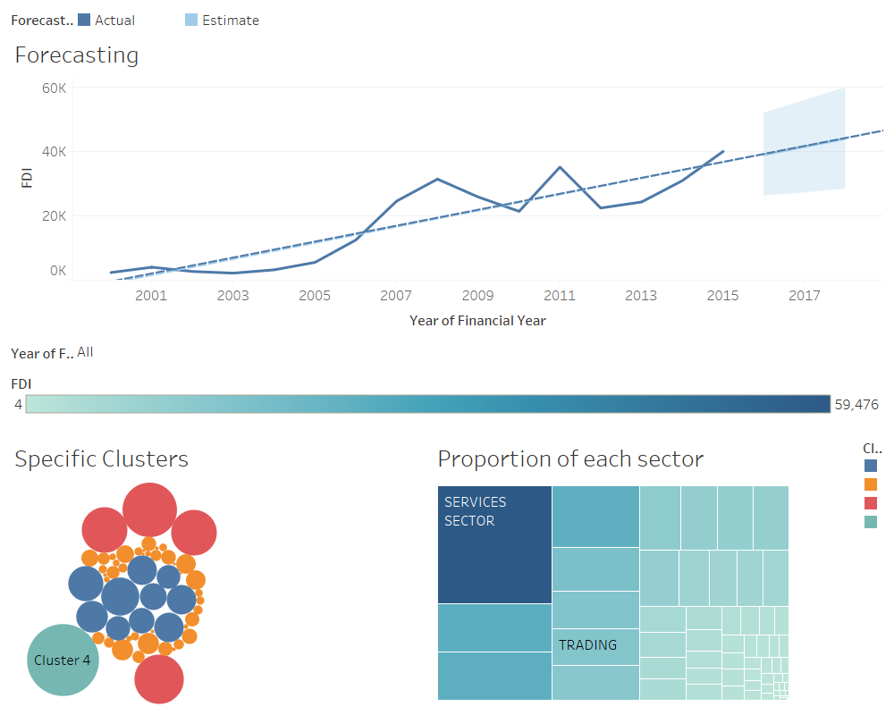

# Tableau-Project-1
# Analysis of Foreign Direct Investment in different sectors in India
# What is Tableau ?  

Tableau software is one of the fastest growing data visualization tools which is currently being used in the Business intelligence industry.  
It is the best way to change or transform the raw set of data into an easily understandable format with zero technical skills and coding knowledge.   

Tableau is basically a data visualization tool which provides pictorial and graphical representations of data.

## What is Tableau used for?  

Usage of Tableau software are listed below:

- Tableau software is used to translate queries into visualization.  
- It is also used for managing metadata.  
- Tableau software imports data of all sizes and ranges.  
- For a non-technical user, Tableau is a life saver as it offers the facility to create ‘no-code’ data queries.  
- Ever since it was introduced, this data visualization tool is used for Business Intelligence industry. Organizations like Amazon, Walmart, Accenture, Lenovo, and so on widely use Tableau.  

## Screenshot of dashboard created

